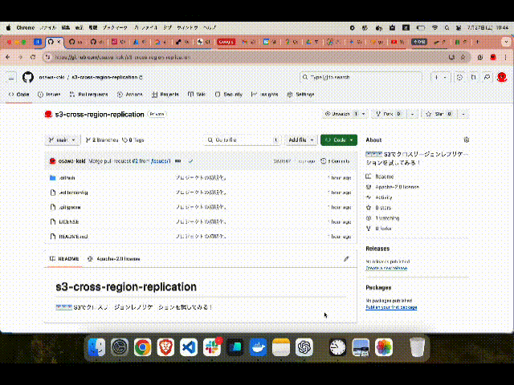

# s3-cross-region-replication

🌁🌁🌁 S3でクロスリージョンレプリケーションを試してみる！  

[](https://github.com/osawa-koki/s3-cross-region-replication/actions/workflows/ci.yml)
[](https://github.com/osawa-koki/s3-cross-region-replication/actions/workflows/cd.yml)

  

## 開発環境の構築方法

最初にAWS CLIをインストールします。  
<https://docs.aws.amazon.com/ja_jp/cli/latest/userguide/install-cliv2.html>  

以下のコマンドを実行して、AWS CLIのバージョンが表示されればOKです。  

```shell
aws --version
```

認証情報を設定します。  

```shell
aws configure
```

以下のように聞かれるので、適宜入力してください。

```shell
AWS Access Key ID [None]: アクセスキーID
AWS Secret Access Key [None]: シークレットアクセスキー
Default region name [None]: リージョン名
Default output format [None]: json
```

---

タグをプッシュすると、GitHub Actionsが実行されて、スタックがデプロイされます。  

| Name | Value |
| --- | --- |
| STACK_NAME | プロジェクト名 |
| AWS_ACCESS_KEY_ID | アクセスキーID |
| AWS_SECRET_ACCESS_KEY | シークレットアクセスキー |
| AWS_REGION | リージョン名 |

## 実行方法

```shell
# Ref: https://docs.aws.amazon.com/ja_jp/AWSCloudFormation/latest/UserGuide/using-cfn-cli-creating-stack.html
aws cloudformation deploy \
    --stack-name <stack-name> \
    --capabilities CAPABILITY_NAMED_IAM \
    --template <template>

# 例)
aws cloudformation deploy \
    --stack-name s3-cross-region-replication \
    --capabilities CAPABILITY_NAMED_IAM \
    --template ./template.yml
```

削除するには、以下のコマンドを実行します。  

```shell
aws cloudformation delete-stack --stack-name <stack-name>

# 例)
aws cloudformation delete-stack --stack-name s3-cross-region-replication
```
